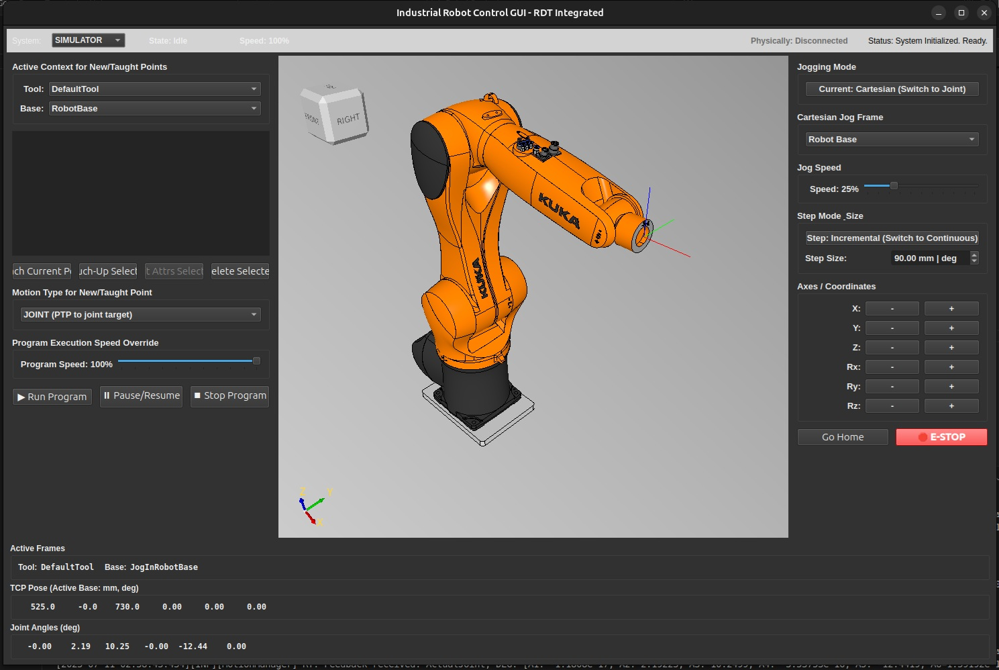

# Robot Development Toolkit (RDT)

⚠️ ⚠️ ⚠️ 

**This is the legacy version of RDT.**  It is now in maintenance mode, meaning it will only receive critical bug fixes. For the new, actively developed version, please see the [**RDT-next** repository](https://github.com/hexakinetica/RDT-core-next).

⚠️ ⚠️ ⚠️

 
**A production-grade, open-source C++ architecture for industrial robot controllers.**

This repository contains the full source code for the Robot Development Toolkit (RDT), the project at the heart of the book "[The RDT Book: Building a Real-World Robot Control System](https://github.com/hexakinetica/rdt-book)".

🎥 *Watch on YouTube*: [Demo Video](https://youtu.be/JDtNz1AyA9I)

## ⚠️ Project Status:: Public Beta Version

**This is a beta-level demonstration project.** The primary goal of this codebase is to serve as a **learning tool** and a **living architectural blueprint**. It is designed to be read, understood, and experimented with.

**What this means for you:**

*   **There are bugs and known issues.** The system is functional for its intended "happy path" scenarios but has not been hardened for production use. You will find rough edges, TODOs, and plenty of "косяков" (as we say).
*   **The architecture is the main feature.** The core value here is not in the flawless execution of every edge case, but in the clear, modular, and layered design that demonstrates professional engineering principles.
*   **This is a perfect place to contribute!** Finding and fixing these bugs, improving the build system, or adding features discussed in the book are fantastic ways to dive into industrial robotics and make a real impact on the project.

Think of it as a car with a beautifully designed engine and chassis, but the radio might crackle and the glove box doesn't quite close. The fundamentals are solid, and we invite you to help us finish the interior.

## 🧭 Filosofía:: A Field Manual for Robot Control

This is not just another academic simulator. RDT is a "field manual" in C++ form, designed to bridge the huge gap between university-level robotics (like basic ROS scripts) and the robust, deterministic, and maintainable systems required on a factory floor.

The project is architected from the ground up to demonstrate key principles of industrial automation software:

*   **Strict RT/NRT Separation**: A deterministic real-time (RT) `MotionManager` core for motion execution, completely decoupled from a flexible non-real-time (NRT) domain (`RobotController`, `TrajectoryPlanner`) for high-level logic, planning, and UI.
*   **Layered & Decoupled Architecture**: Using interfaces (`IHardwareInterface`, `KinematicSolver`) and a central state bus (`StateData`) to create modular, testable, and extensible components.
*   **Hardware Abstraction Layer (HAL)**: A pluggable `MasterHardwareInterface` that allows the system to run with an `InternalSimulation` or real hardware (`UdpInterface`, `EthercatInterface`) without changing a single line of core logic.
*   **Strongly-Typed Units**: A custom units library (`Units.h`) that uses the type system to prevent common errors, such as mixing meters and millimeters or radians and degrees at compile time.
*   **Modern C++**: Leveraging C++20 features like `std::jthread`, `std::atomic`, `std::shared_mutex`, and smart pointers for robust, safe, and readable code.

## Architectural Overview

The project is structured as a series of modular libraries, each representing a key architectural component. The main application in `1_RobotControl_main` assembles these components into a cohesive control system.

| Module Directory | Architectural Role | Description |
| :--- | :--- | :--- |
| `1_RobotControl_main` | **HMI / Application** | The main executable, Qt6-based GUI panels, and the "composition root" where all modules are assembled via the `Adapter_RobotController`. |
| `data_types_rdt` | **Core Data Types** | Defines fundamental, strongly-typed units (`Meters`, `Radians`) and data structures (`CartPose`, `AxisSet`, `TrajectoryPoint`). |
| `state_data_nrt` | **State Bus (SSOT)** | A thread-safe "blackboard" (`StateData`) acting as a Single Source of Truth for sharing state across NRT modules (e.g., between the controller and GUI adapter). |
| `kinematic_solver_nrt`| **Kinematics Engine** | Solves Forward/Inverse Kinematics via the `KinematicSolver` interface. Includes a concrete implementation (`KdlKinematicSolver`) that wraps the Orocos KDL library. |
| `spatial_math_` | **Frame Transformations** | Provides the `FrameTransformer` utility for performing 3D coordinate transformations using the Eigen library. |
| `interpolator_nrt` | **Trajectory Interpolator** | Implements the Strategy pattern (`MotionProfile`) for generating smooth motion profiles (LIN, PTP) with trapezoidal velocity. |
| `trajectory_planner_nrt`| **Trajectory Planner** | Orchestrates the `TrajectoryInterpolator` and `KinematicSolver` to convert a single user command into a detailed, kinematically valid trajectory segment. |
| `robot_controller_nrt`| **NRT Orchestrator** | The "brain" of the NRT domain. Manages system state, handles user commands, and orchestrates the planner to feed the RT core. |
| `trajectory_queue_lf`| **RT/NRT Bridge** | A lock-free, single-producer, single-consumer (SPSC) queue used to safely pass trajectory points from the NRT planner to the RT motion manager. |
| `motion_manager_rt` | **Real-Time Core** | The deterministic, high-priority thread (`MotionManager`) that executes trajectories by sending commands to the HAL at a fixed rate. |
| `motion_interface_hal`| **Hardware Abstraction** | Defines the `IHardwareInterface` contract and its concrete implementations (`InternalSimulation`, `UdpInterface`, `EthercatInterface`). |
| `logger` | **Logging Service** | A centralized, thread-safe logging utility. |

---

## Getting Started

### 1. Dependencies

This project relies on several third-party libraries. On a Linux-based system (like Ubuntu 22.04), you will need:
*   **Build System**: CMake (version 3.16+)
*   **Compiler**: A C++20 compliant compiler (e.g., GCC 11+)
*   **Core Libraries**:
    *   **Qt6**: For the Human-Machine Interface (HMI). (`qt6-base-dev`)
    *   **Eigen 3.4.0**: For linear algebra. (`libeigen3-dev`)
    *   **Orocos KDL**: For kinematics. (`liborocos-kdl-dev`)
    *   **OCCT 7.6+**: For 3D visualization and STEP file parsing. (`libocct-data-exchange-dev`, `libocct-visualization-dev`)
    *   **TinyXML2**: For configuration or data serialization. (`libtinyxml2-dev`)
    *   **FreeType**: A dependency for OCCT text rendering. (`libfreetype-dev`)

---

## How to Contribute

We are thrilled you're interested in contributing! This project is driven by the community, and we welcome all contributions.

1.  **Code & Features**: Found a bug? Have an idea for a new feature discussed in the book (like Spline motion)?
    *   Fork the **[Controller Repository](https://github.com/hexakinetica/rdt-core)**.
    *   Create a new branch for your feature or fix.
    *   Submit a Pull Request! Please open an issue first to discuss larger changes.

2.  **Book & Documentation**: Found a typo, a logical error, or have a suggestion to improve the explanations in the book?
    *   Fork the **[Book Repository](https://github.com/hexakinetica/rdt-book)**.
    *   Submit a Pull Request with your proposed changes.

### 🧩 Related Projects

- More robotics content on our [YouTube channel](https://www.youtube.com/@hexakinetica)

### Contact

Email: contact@hexakinetica.com
Website: https://www.hexakinetica.com

### Disclaimer

The robot models included are for visualization and educational purposes only and are not official models from their respective manufacturers. They are not intended for manufacturing, engineering, or commercial use. All trademarks, product names, and company names mentioned are the property of their respective owners.

The software is provided "as is" without any guarantee of accuracy, completeness, or fitness for any particular purpose.
If you are the copyright holder or believe any material posted violates your rights, please contact us to request removal.

### Open Source License (GPL v3)
This project is free software: you can redistribute it and/or modify it under the terms of the **GNU General Public License as published by the Free Software Foundation**, either version 3 of the License.

**What this means:**
*   ✅ You can use this software for personal projects, education, and research.
*   ✅ You can modify the code and distribute it.
*   ⚠️ **Condition:** If you distribute this software (or a modified version of it), you **must open-source your code** under the same GPL v3 license.

See the [LICENSE](LICENSE) file for the full text.
